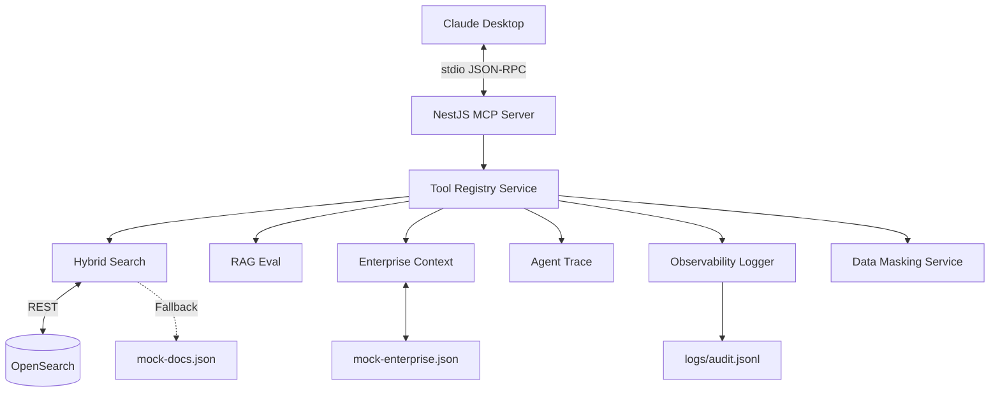

# Enterprise Context Bridge (ECB)

An "Enterprise-grade" Model Context Protocol (MCP) Server built with NestJS and TypeScript. It empowers Claude with specific enterprise capabilities:
1. Hybrid search over document stores (OpenSearch).
2. Autonomous LLM evaluation scoring (RAG Evaluation).
3. Secure enterprise context retrieval (mocked SAP, Jira integrations with data masking).
4. Traceability and observability.

## Architecture



## Setup & Running

1. **Install Dependencies**
   ```bash
   npm install
   ```

2. **Configure Environment**
   ```bash
   cp .env.example .env
   ```
   *Edit `.env` if you have a real OpenSearch cluster. Otherwise, the app uses graceful mock fallbacks.*

3. **Start OpenSearch (Optional)**
   ```bash
   docker-compose up -d
   ```

4. **Build the Project**
   ```bash
   npm run build
   ```

5. **Start Standalone Testing Server**
   ```bash
   npm start
   ```

## Adding to Claude Desktop

Edit your `claude_desktop_config.json` file. Provide the absolute path to `dist/main.js`. See `claude_desktop_config.example.json` for details.

## Development

- `npm run start:dev` - Run with ts-node
- `npm run test` - Run Jest tests
- `npm run lint` - Run ESLint